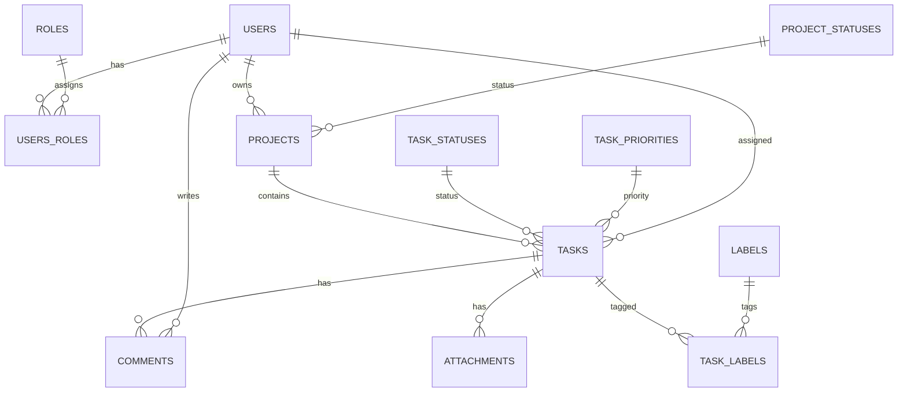

# Task Management App (Spring Boot)


A REST API for managing projects and tasks: user registration/authentication, CRUD for projects and tasks, task comments, labels, and file attachments (files are stored in **Dropbox**, while the database stores only Dropbox reference/metadata).

## Clone & run

### Clone the repository

```bash
git clone <REPO_URL>
cd <REPO_FOLDER>
```

### Run with Maven (local)

```bash
./mvnw spring-boot:run
```

### Run with Docker Compose

```bash
docker compose up --build
```

### Environment variables (example, **no secrets**)

> Store real secrets (DB passwords, Dropbox token) in your local `.env` file or CI secrets — never commit them.

```env
SPRING_DATASOURCE_URL=jdbc:mysql://localhost:3307/task_management
SPRING_DATASOURCE_USERNAME=db_user
SPRING_DATASOURCE_PASSWORD=db_password_placeholder
SPRING_DOCKER_PORT=8080

DROPBOX_ACCESS_TOKEN=dropbox_token_placeholder
```

---

## Tech stack

- **Java 17**
- **Spring Boot 3.x** (Web, Validation, Data JPA, Security, Actuator)
- **JWT authentication** (stateless, Bearer token)
- **MySQL 8** (runtime) + **H2** (tests)
- **Liquibase** (DB migrations) — `src/main/resources/changelog/`
- **MapStruct** + **Lombok**
- **Swagger / OpenAPI** (springdoc)
- **Dropbox API / SDK** (attachments)

---

## Features

- ✅ User registration & login (JWT)
- ✅ User profile (`/users/me`) + password update
- ✅ Projects: create / read / update / delete
- ✅ Tasks inside projects: CRUD + assign users
- ✅ Labels for tasks (add/remove/list)
- ✅ Comments for tasks
- ✅ Attachments: upload/download via Dropbox
- ✅ Roles: `USER`, `ADMIN` (method-level security via `@PreAuthorize`)

---

## Getting started with Docker

### 1) Create `.env`

Copy `.env.sample` → `.env` and fill in the values:

```bash
cp .env.sample .env
```

Minimal example:

```env
# ---------- DATABASE ----------
MYSQLDB_USER=SunUser
MYSQLDB_ROOT_PASSWORD=your_root_password
MYSQLDB_DATABASE=task_management
MYSQLDB_LOCAL_PORT=3307
MYSQLDB_DOCKER_PORT=3306

# ---------- SPRING BOOT ----------
SPRING_LOCAL_PORT=8088
SPRING_DOCKER_PORT=8080
DEBUG_PORT=5005

# ---------- DROPBOX ----------
DROPBOX_ACCESS_TOKEN=your_dropbox_access_token
```

### 2) Run

```bash
docker compose up --build
```

- API: `http://localhost:8088`
- Swagger UI: `http://localhost:8088/swagger-ui.html`
- OpenAPI JSON: `http://localhost:8088/v3/api-docs`

> If your compose file exposes a debug port, you can attach a remote debugger using `DEBUG_PORT`.

---

## Run locally (without Docker)

### Requirements
- Java **17**
- MySQL **8** (local or via Docker)
- Dropbox access token (for attachments)

### Configuration

Prefer environment variables (recommended) or update `src/main/resources/application.properties`.

Supported env variables:

- `SPRING_DATASOURCE_URL` (default: `jdbc:mysql://localhost:3307/task_management`)
- `SPRING_DATASOURCE_USERNAME`
- `SPRING_DATASOURCE_PASSWORD`
- `SPRING_DOCKER_PORT` (default: `8080`)
- `DROPBOX_ACCESS_TOKEN`

### Start the application

```bash
./mvnw spring-boot:run
```

or

```bash
./mvnw clean package
java -jar target/*.jar
```

---

## Authentication (JWT)

1) **Register**
- `POST /api/auth/register`

2) **Login**
- `POST /api/auth/login` → returns JWT

3) Add the header to protected requests:

```
Authorization: Bearer <YOUR_TOKEN>
```

---

## API endpoints (overview)

> The exact routes may differ slightly depending on your implementation. Use Swagger UI for the most up-to-date list.

### Auth & users (`/api`)
- `POST /api/auth/register` — register
- `POST /api/auth/login` — login (JWT)
- `GET /api/users/me` — current user profile *(USER/ADMIN)*
- `PUT /api/users/me` — update profile *(USER/ADMIN)*
- `PATCH /api/users/me/password` — change password *(USER/ADMIN)*
- `PUT /api/users/{id}/role?roleName=ADMIN|USER` — update role *(ADMIN)*

### Projects (`/api/projects`)
- `POST /api/projects` — create project *(USER/ADMIN)*
- `GET /api/projects/{id}` — get project *(USER/ADMIN)*
- `GET /api/projects/my-projects` — my projects *(USER/ADMIN)*
- `PUT /api/projects/{id}` — update project *(USER/ADMIN)*
- `DELETE /api/projects/{id}` — delete project *(USER/ADMIN)*

### Tasks (`/api/tasks`)
- `POST /api/tasks` — create task *(USER/ADMIN)*
- `GET /api/tasks/{id}` — get task *(USER/ADMIN)*
- `PUT /api/tasks/{id}` — update task *(USER/ADMIN)*
- `DELETE /api/tasks/{id}` — delete task *(USER/ADMIN)*
- `GET /api/tasks?projectId={projectId}` — tasks by project *(USER/ADMIN)*
- `POST /api/tasks/{taskId}/labels/{labelId}` — add label *(USER/ADMIN)*
- `DELETE /api/tasks/{taskId}/labels/{labelId}` — remove label *(USER/ADMIN)*
- `GET /api/tasks/{id}/labels` — list task labels *(USER/ADMIN)*

### Labels (`/api/labels`)
- `POST /api/labels` — create label *(ADMIN)*
- `GET /api/labels` — list labels *(USER/ADMIN)*
- `PUT /api/labels/{id}` — update label *(USER/ADMIN)*
- `DELETE /api/labels/{id}` — delete label *(USER/ADMIN)*

### Comments (`/api/comments`)
- `POST /api/comments` — create comment *(USER/ADMIN)*
- `GET /api/comments?taskId={taskId}` — comments by task *(USER/ADMIN)*

### Attachments (`/api/attachments`)
- `POST /api/attachments?taskId={taskId}` — upload file (multipart) *(USER/ADMIN)*
- `GET /api/attachments?taskId={taskId}` — list task attachments *(USER/ADMIN)*
- `GET /api/attachments/{id}/download` — download attachment *(USER/ADMIN)*

---

## Request examples (curl)

### Register
```bash
curl -X POST http://localhost:8088/api/auth/register \
  -H "Content-Type: application/json" \
  -d '{
    "username": "john",
    "email": "john@example.com",
    "password": "password123",
    "firstName": "John",
    "lastName": "Doe"
  }'
```

### Login
```bash
curl -X POST http://localhost:8088/api/auth/login \
  -H "Content-Type: application/json" \
  -d '{
    "username": "john",
    "password": "password123"
  }'
```

### Create project (with JWT)
```bash
TOKEN="paste_token_here"

curl -X POST http://localhost:8088/api/projects \
  -H "Authorization: Bearer $TOKEN" \
  -H "Content-Type: application/json" \
  -d '{
    "title": "My Project",
    "ownerId": 1,
    "startDate": "2025-12-16",
    "endDate": "2026-01-16",
    "description": "Demo project"
  }'
```

### Upload attachment (multipart)
```bash
curl -X POST "http://localhost:8088/api/attachments?taskId=1" \
  -H "Authorization: Bearer $TOKEN" \
  -F "file=@./some-file.pdf"
```

---

## Database schema (high-level)



---

## Liquibase

Migrations are located here:

- `src/main/resources/changelog/db.changelog-master.yaml`
- `src/main/resources/changelog/changes/*.yaml`

---

## Tests

Run tests:

```bash
./mvnw test
```

Notes:
- Tests typically use **H2** (`application-test.properties`)
- SQL scripts for tests (if present): `src/test/resources/testData/`

---

## Checkstyle

Config:

- `config/checkstyle/checkstyle.xml`

Run verification (including Checkstyle):

```bash
./mvnw verify
```

---

## Swagger / OpenAPI

After starting the app:

- Swagger UI: `http://localhost:8088/swagger-ui.html`
- OpenAPI JSON: `http://localhost:8088/v3/api-docs`

---

## Project structure

```
src/main/java/mate/academy/taskmanagementapp
├── controller
├── dto
├── mapper
├── model
├── repository
├── security
└── service
```

---


>✅ Made by **Oleksandr Sunless**

